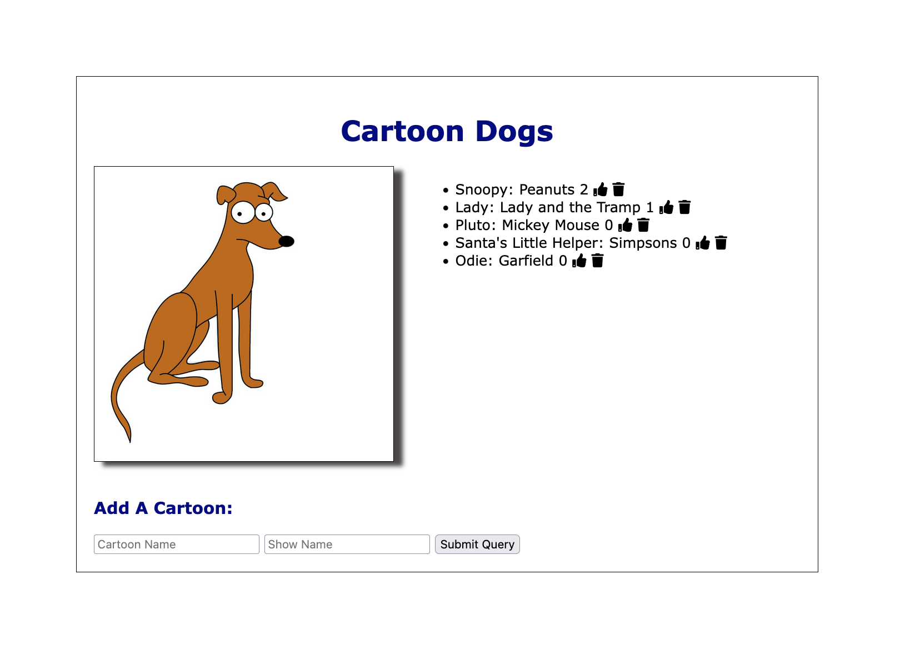

# Introduction

A Simple Cartoon Dog Api built using minimal code to connect to a database to store, change and delete enteries. 

---

# Objectives

- It's a beginner level api app with express and MongoDB.

---

# Who is this for? 

- It's for beginners & intermediates with little more experience, to help understand the various aspects of building a basic API with some complex features
like liking and deleting an entry.
---

- Create a `.env` file and add the following as `key: value` 
  - PORT: 400 (can be any port example: 3000) 
  - DB_STRING: `your database URI` 
 ---
